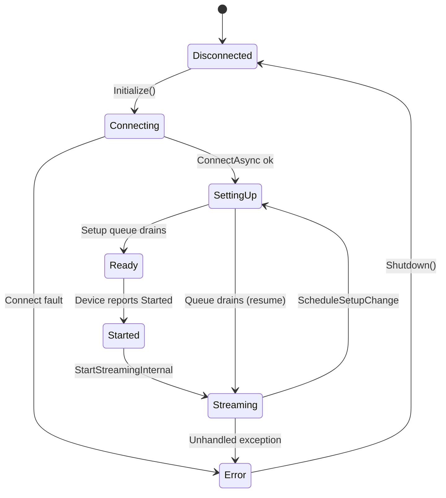
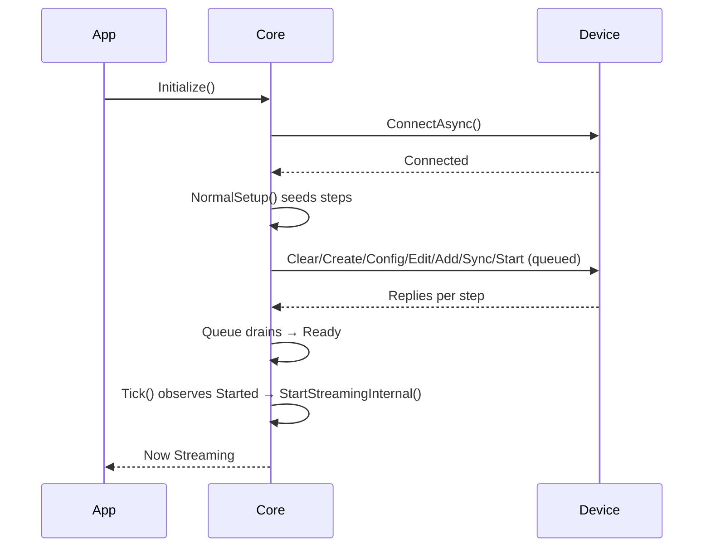

# Core Architecture (Transport, Codec, Core)

This guide explains the stack beneath the core—how bytes move from transports to the frame codec to the core—and the lifecycle flows (initialize, setup, start/stop streaming, mid-stream edits with replies, reset/shutdown).

## Stack Summary
- Transport (`WSSBaseCode/Interfaces/ITransport.cs`)
  - Serial: `WSSBaseCode/SerialPortTransport.cs`; Test: `WSSBaseCode/TestModeTransport.cs`
  - Surfaces `BytesReceived` chunks (no message boundary guarantee).
- Frame Codec (`WSSBaseCode/Interfaces/IFrameCodec.cs` → `WSSBaseCode/WssFrameCodec.cs`)
  - Frames/deframes bytes and validates messages.
- Core (`WSSBaseCode/WssStimulationCore.cs`)
  - State machine: Disconnected → Connecting → SettingUp → Ready → Started → Streaming (→ Error)
  - Queues setup steps; non-blocking public calls schedule device edits.
  - Background streaming loop sends periodic packets when in `Streaming`.


## Lifecycle: States and Transitions


## Startup Sequence


Notes
- `NormalSetup()` seeds a full device configuration and ends with `StartStim(...)` for each target.
- `Tick()` advances the state machine; `StartStreamingInternal()` begins the background streaming loop.

## Mid‑Stream Setup (Commands Requiring Replies)
```mermaid
sequenceDiagram
  participant App
  participant Core
  participant Device
  App->>Core: e.g., Request_Configs(cmd,id)
  Note over Core: If Streaming → StopStreamingInternal(); resumeAfter = true
  Core->>Device: Send command (await reply)
  Device-->>Core: Reply or timeout
  alt Success
    Core->>Core: Queue drains; if resumeAfter → StartStreamingInternal()
  else Timeout/Error
    Core->>Core: State = Error; SafeDisconnect()
  end
```

Behavior
- Public mutators (e.g., `StartStim`, `StopStim`, `UpdateIPD`, waveform edit/load/save/load) call `ScheduleSetupChangeAsync`.
- If currently `Streaming`, streaming pauses once for the batch, then resumes automatically when the queue drains.
- Steps await replies; `StepLogger` throws on device `Error:` or timeout.

## Start and Stop
- Start
  - From `Ready`, calling `StartStim(...)` schedules a start step; when the device reports started, state advances and streaming begins.
- Stop
  - Calling `StopStim(...)` schedules stop; if streaming, the core also stops the streaming loop immediately. After the queue drains, streaming resumes if further edits are pending/resume was requested.
  - To fully stop activity, follow with `Shutdown()` or avoid scheduling additional edits.

## Reset and Shutdown
- Reset (device MCU): use `WssClient.Reset(...)` as a scheduled setup step so the core pauses streaming and waits for the reply before resuming. Example:
```csharp
_ = ScheduleSetupChangeAsync(WssTarget.Wss1,
    () => StepLogger(_wss.Reset(WssTarget.Wss1), "Reset[Wss1]"));
```
- Shutdown
  - `Shutdown()` stops streaming, attempts `ZeroOutStim()`, disconnects, and disposes transport/client.

## Edge Cases
- Scheduling edits while `SettingUp` appends to the queue; the runner performs additional passes until empty.
- Errors during setup set state to `Error`; `Tick()` then stops streaming and disconnects.
- Long-running streaming: periodic packets are sent per WSS at the configured cadence; unchanged parameters send minimal data.

## Optional Basic Stimulation Layer
- `IBasicStimulation` augments the core with waveform/event/config operations. In the current implementation, `WssStimulationCore` implements this interface and routes calls through `ScheduleSetupChangeAsync`, which:
  - Pauses streaming if active, enqueues setup steps that await device replies, and resumes streaming when the queue drains.
  - Ensures mid-stream edits are safe and ordered across targets.
- Future: split into finer capabilities (waveform upload, event editing, config persistence/query) to align with firmware/hardware feature variations.
