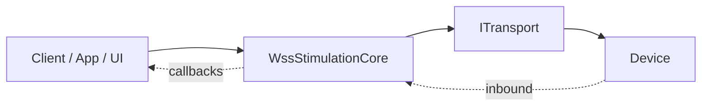
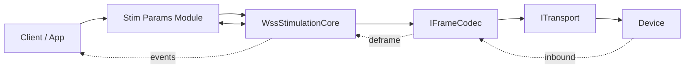
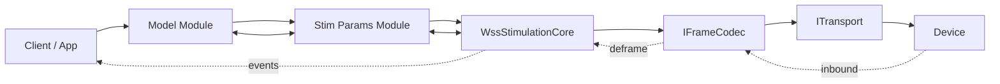

# Layering Guide (Modules)

This guide focuses on how functionality grows as you add modules on top of the core. It illustrates three configurations: Core only, Core + Params, and Core + Params + Model.

## Core Only

- Capabilities:
  - Connect/disconnect, send/receive via `ITransport`.
  - Frame parsing/assembly via `IFrameCodec`.
  - Background streaming loop; queued edits; lifecycle orchestration.
- Key code:
  - Core: `WSSBaseCode/WssStimulationCore.cs`
  - Codec: `WSSBaseCode/WssFrameCodec.cs` (`WSSBaseCode/Interfaces/IFrameCodec.cs`)
  - Transport: `WSSBaseCode/SerialPortTransport.cs`, `WSSBaseCode/TestModeTransport.cs` (`WSSBaseCode/Interfaces/ITransport.cs`)

## Core + Params Module

- Enhancements over Core only:
  - Centralized parameter definitions, defaults, and validation.
  - Helpers to apply parameter sets to the device safely.
- Key code:
  - Module: `CalibrationModule/StimParamsLayer.cs`, `CalibrationModule/StimParamsConfig.cs`, `CalibrationModule/StimParamsConfigController.cs`, `CalibrationModule/IStimParamsCore.cs`
  - Config plumbing: `WSSBaseCode/CoreJsonConfig/*`

## Core + Params + Model Module

- Enhancements over Core + Params:
  - Model-specific configuration, constraints, and workflows layered on top of parameters.
  - Clear separation of generic parameter management (Params) vs. model specialization (Model).
- Key code:
  - Module: `ModelModule/ModelParamsLayer.cs`, `ModelModule/ModelConfig.cs`, `ModelModule/ModelConfigController.cs`, `ModelModule/IModelParamsCore.cs`

## Guidance
- Compose the core with modules at the app boundary. Pass interfaces; avoid tight coupling.
- Keep protocol framing and transport mechanics outside modules; modules should express domain behaviors and constraints.
- See also: Core Architecture for transport/codec/core wiring and data flow.

## Optional Capability: Basic Stimulation

The Basic Stimulation interface (`WSSBaseCode/Interfaces/IBasicStimulation.cs`) is an optional capability layer that adds higher-level stimulation operations on top of the core. It is suitable for firmware/hardware that supports waveform editing, event shaping, and config persistence.

- Purpose
  - Provide a minimal, consistent API to upload/select waveforms and to save/load/query board configuration.
  - All calls are non-blocking; implementations enqueue setup steps and wait for device replies.
- Key operations
  - `UpdateEventShape`, `UpdateWaveform` (builder or raw), `WaveformSetup`
  - `Save`, `Load`, `Request_Configs`
  - `UpdateIPD` (global or per-event)
- Relationship to modules
  - Can be used with Core only, with Params, or with Params + Model. Modules can delegate to `IBasicStimulation` for device edits.
- Future direction
  - Split `IBasicStimulation` into smaller capability interfaces to match firmware/hardware feature sets (e.g., `IWaveformUpload`, `IEventEditing`, `IConfigPersistence`, `IConfigQuery`).
  - Compose the final “stimulator” from supported capability interfaces at runtime.
