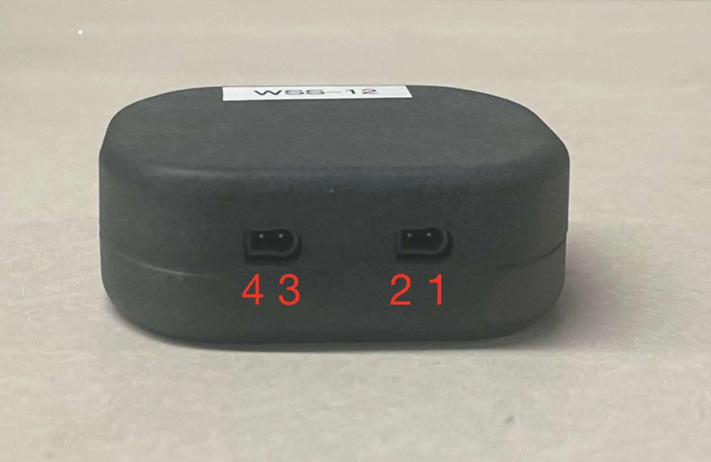
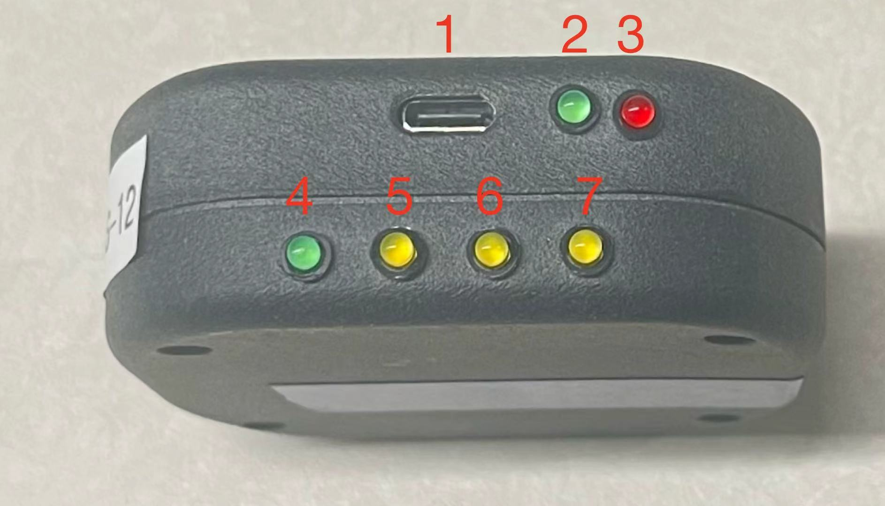
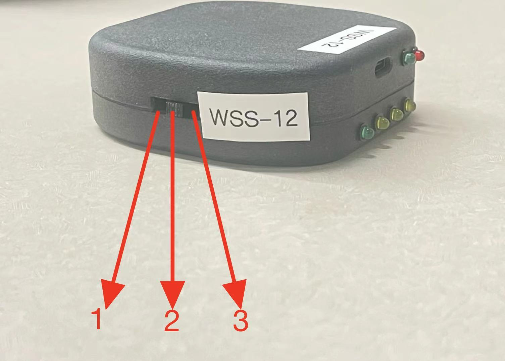
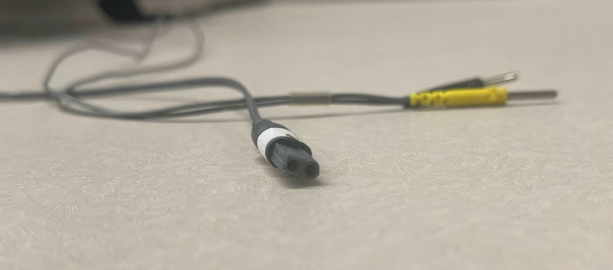
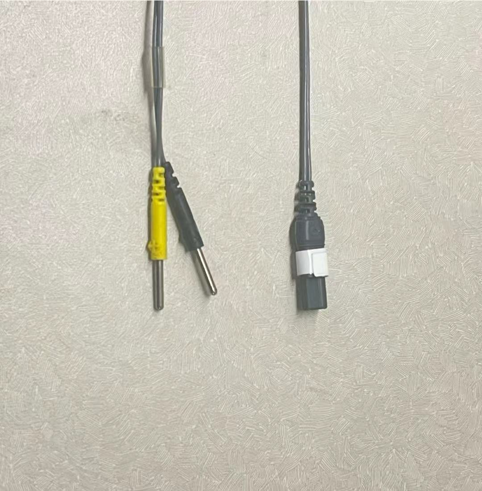
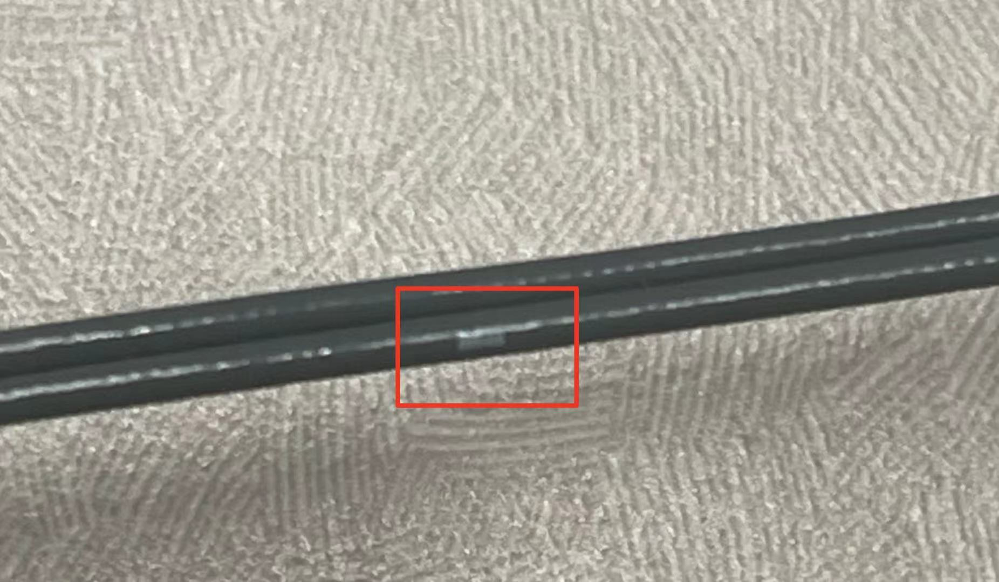
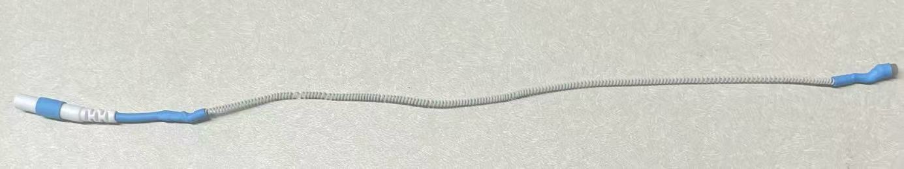
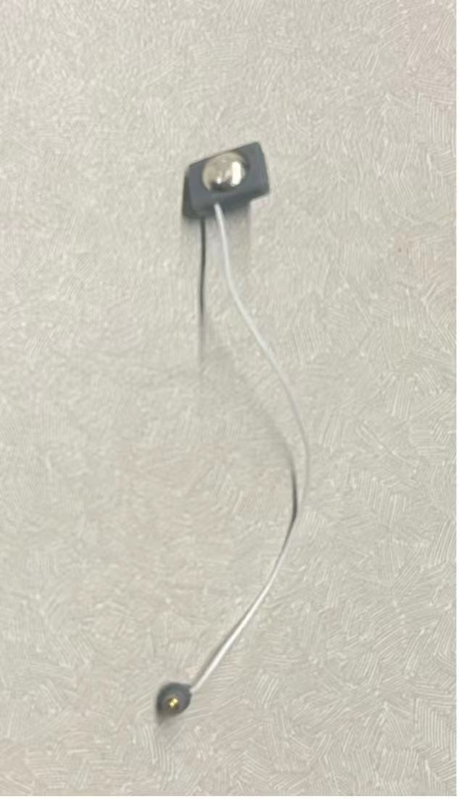
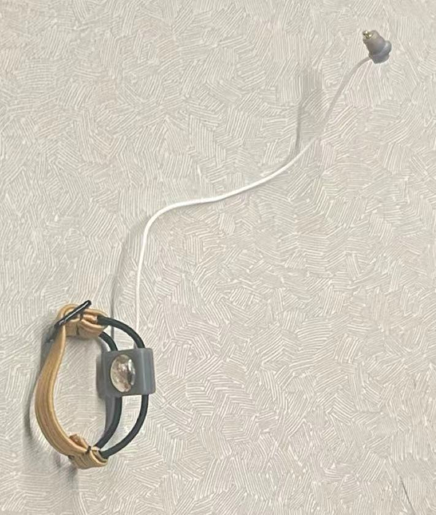

---
output:
  html_document: default
  pdf_document: default
---
# WSS (Wearable Stimulation System)

WSS is a modular and programmable system for delivering Functional Electrical Stimulation (FES) using dry active electrodes. The system consists of a gray stimulation unit (main device), electrode cables, and a gold control unit for wireless operation.

## 1. Gray Box – Main Stimulation Unit

The gray box is the core of the system. It has multiple labeled faces, each with distinct functionality.

### Face A – Output Panel

```{r fig1, echo=FALSE, out.width="300px", fig.align='center', fig.cap='Figure 1. Output panel with labeled connectors 1–4.'}

```

This panel contains two output ports, each with two internal connectors.

- Port shape: asymmetric rectangle (one edge straight, one edge curved)
- Total of 4 pin connectors:
  - Left port: pins 4 and 3
  - Right port: pins 2 and 1
- Connects to the main stimulation cable via a keyhole connector

### Face B – Type-C and LED Panel

```{r fig2, echo=FALSE, out.width="300px", fig.align='center', fig.cap='Figure 2. Rear panel with USB-C and two LED rows (labeled 1–7).'}

```

This panel includes two horizontal rows, each with functional components labeled in the image above:

Top Row (Labels 1–3):

- (1) USB Type-C port – used for charging the gray box
- (2) Green LED – turns on when charging is in progress
- (3) Red LED – turns on when charging is complete

Bottom Row (Labels 4–7):

- (4) Green LED – indicates the device is powered on
- (5, 6, 7) Yellow LEDs – programmable indicators for user-defined feedback (e.g., command status, stimulation phase, debug info)

> Charging requires a 5V power adapter and only functions when the mode switch is set to Charging.

### Face C – 3-Way Power Mode Switch

```{r fig3, echo=FALSE, out.width="300px", fig.align='center', fig.cap='Figure 3. Side panel with 3-way power mode switch labeled with three positions.'}

```

The device is controlled by a three-position switch:

- (1) On: enables full operation, receives and executes radio commands
- (2) Off: device completely powered off
- (3) Charging: enables battery charging; program logic disabled

> The device will not charge unless the switch is in Charging mode.
> The device will not run any programs in Charging mode.

### Audio Feedback

The gray box provides internal audio cues:

- "On" sound: device successfully powered on
- "Start" sound: stimulation started
- "End" sound: stimulation completed
- "Warning" sound: error occurred, device requires reboot

## 2. Cable and Electrode System

### Main Stimulation Cable

The main stimulation cable connects the gray box (WSS output port) to the blue electrode adapter cable. It transmits the stimulation current via two independent wires—each corresponding to one output channel (positive and negative).

#### Keyhole Connector Overview

```{r fig4, echo=FALSE, out.width="300px", fig.align='center', fig.cap='Figure 4. Keyhole connector interface used to connect to the output port of the gray box.'}

```

The gray box features keyhole-shaped output ports, each with two internal contacts. The stimulation cable plugs into one of these ports via a precisely shaped connector that ensures correct alignment.

- Each port accepts one keyhole connector
- Each connector contains two holes, which correspond to the positive (+) and negative (–) terminals

#### Cable End Overview

```{r fig5, echo=FALSE, out.width="300px", fig.align='center', fig.cap='Figure 5. Top-down view of both ends of the stimulation cable: keyhole connector (left) and 2mm touchproof connector (right).'}

```

- The keyhole connector end plugs into the gray box
- The 2mm touchproof plugs on the other end connect to the blue adapter cable

Each internal wire from the keyhole connector is routed to a separate 2mm touchproof connector.

#### Polarity Identification

```{r fig6, echo=FALSE, out.width="300px", fig.align='center', fig.cap='Figure 6. Keyhole connector showing white polarity marker on the cable jacket. This indicates the positive (+) side.'}

```

To distinguish polarity:

- The cable wire with a white square label wrapped around the jacket corresponds to the positive (+) terminal
- The other wire, without a marker, is the negative (–) terminal

### Blue Electrode Adapter Cable

```{r fig7, echo=FALSE, out.width="300px", fig.align='center', fig.cap='Figure 7. Blue adapter cable with touchproof input and snap connector output.'}

```

- Connects from 2mm touchproof to the dry electrode

### Dry Active Electrode and ACE Ring  (HFI only)

The dry active electrode is a reusable stimulation interface. It is mounted on an ACE ring to ensure repeatable finger placement.

#### Electrode Overview

```{r fig8, echo=FALSE, out.width="300px", fig.align='center', fig.cap='Figure 8. Dry active electrode front view.'}

```

This is a reusable electrode with a metallic conductive face. It connects via snap socket and is designed for contact on the skin.
A side groove is present along the base, designed to slide into the elastic track of the ACE ring.

#### Electrode Embedded in ACE Ring

```{r fig10, echo=FALSE, out.width="300px", fig.align='center', fig.cap='Figure 10. Dry electrode mounted into ACE ring track.'}

```

The ACE ring consists of two elastic bands forming a guide rail for the electrode. The electrode snaps in and holds steadily against the finger.

#### Finger Mounting Demonstration

```{r fig11, echo=FALSE, fig.show='hold', out.width='45%', fig.align='center', fig.cap='Figure 11. Dry electrode worn on finger: back view (left) and palm view (right).'}
knitr::include_graphics(c("images/electrode_back_view.jpg", "images/electrode_palm_view.jpg"))
```

## 3. Gold Control Box – Wireless Command Sender

Each gold box serves as a wireless controller that communicates with a specific gray box. Communication is established via radio, and pairing is fixed one-to-one based on labeled ID.

```{r fig12, echo=FALSE, fig.show='hold', out.width='32%', fig.align='center', fig.cap='Figure 12. Gold control box. Left: full view (with labeled pairing ID); center: Micro-USB-C interface side; right: alternate viewing angle.'}
knitr::include_graphics(c("images/gold_box_main.jpg", "images/gold_box_microc.jpg", "images/gold_box_alt_view.jpg"))
```

The gold box is a rectangular controller designed to send serial commands to the gray box wirelessly. It connects to a PC via a Micro-USB-C interface and is identified by a unique ID printed on a label at the bottom of the unit.

- Communication: One-to-one pairing with gray box, fixed via matching ID label
- Connection to PC: Micro-USB-C port (visible on the narrow side)

> Each gold box is dedicated to a specific gray box. The matching ID can be found on the bottom label of each unit.
